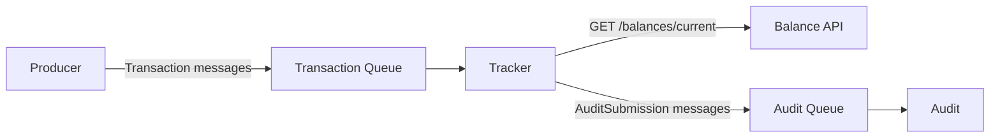
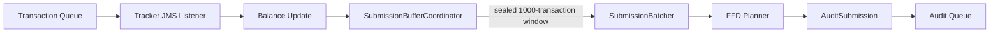

# Bank Account Exercise

## What This Solution Does

This repository contains a small event-driven bank-account system split across separate JVMs:

- `producer`
  Generates credit and debit transactions on two dedicated threads and publishes them to Artemis.
- `tracker`
  Consumes transactions, maintains the live account balance, exposes a REST endpoint for balance lookups, and builds audit submissions every 1000 transactions.
- `broker`
  A mocked embedded ActiveMQ Artemis broker used for local development.
- `audit`
  A mocked downstream audit consumer that prints received audit submissions to the console.

## High-Level Flow

1. `producer` creates credit and debit `Transaction` messages.
2. Messages are published to the transaction queue on Artemis.
3. `tracker` consumes each transaction and updates the running balance.
4. `tracker` appends transactions into rotating in-memory submission buffers.
5. Every sealed 1000-transaction window is handed to the background batcher.
6. The batcher groups transactions into `AuditBatch` items where each batch total stays at or below `1,000,000`.
7. The resulting `AuditSubmission` is published to the audit queue.
8. `audit` consumes the submission and prints it as formatted JSON.



## Runtime Components

### Producer

Location: [`apps/producer`](C:/git/exercise-bank_account/apps/producer)

Key behavior:

- runs two dedicated workers, one for credits and one for debits
- defaults to `25` credits/sec and `25` debits/sec
- generates values between `200` and `500000`
- publishes to the transaction queue through the shared JMS publisher

### Tracker

Location: [`apps/tracker`](C:/git/exercise-bank_account/apps/tracker)

Key behavior:

- listens to the transaction queue
- updates the live balance with a low-contention accumulator
- exposes `GET /balances/current`
- rotates across submission buffers so the hot transaction path stays simple
- seals a buffer every `1000` transactions
- grows the buffer pool from `2` up to `10` if processing falls behind
- batches submissions asynchronously before publishing to the audit queue

### Mocked Broker

Location: [`apps/mocked/broker`](C:/git/exercise-bank_account/apps/mocked/broker)

Key behavior:

- starts an embedded Artemis broker
- exposes a TCP acceptor on `tcp://127.0.0.1:61616` by default
- also exposes an in-vm acceptor for same-process use

### Mocked Audit

Location: [`apps/mocked/audit`](C:/git/exercise-bank_account/apps/mocked/audit)

Key behavior:

- listens to the audit queue
- deserializes `AuditSubmission`
- prints the submission in the mocked downstream format

## Requirements

- Java `21`
- Maven `3.9+` recommended

## How To Start Everything

Start the services in this order from the repo root:

1. Start the mocked broker:

```powershell
mvn -pl apps/mocked/broker -am -DskipTests exec:java "-Dexec.mainClass=com.exercise.bankaccount.broker.BrokerMain"
```

2. Start the tracker:

```powershell
mvn -pl apps/tracker -am spring-boot:run
```

3. Start the mocked audit consumer:

```powershell
mvn -pl apps/mocked/audit -am -DskipTests exec:java "-Dexec.mainClass=com.exercise.bankaccount.audit.AuditMain"
```

4. Start the producer:

```powershell
mvn -pl apps/producer -am spring-boot:run
```

Once all four are running:

- the producer will continuously publish transactions
- the tracker will maintain the live balance
- the audit app will print submissions as they arrive

## Querying The Balance

The tracker REST API is:

```text
GET http://localhost:8080/balances/current
```

Example:

```powershell
curl http://localhost:8080/balances/current
```

## Configuration

### Spring Application Config

Producer config file:
[`apps/producer/src/main/resources/application.yml`](C:/git/exercise-bank_account/apps/producer/src/main/resources/application.yml)

Tracker config file:
[`apps/tracker/src/main/resources/application.yml`](C:/git/exercise-bank_account/apps/tracker/src/main/resources/application.yml)

Producer keys:

- `spring.artemis.broker-url` - Points the producer at the broker instance it should publish to.
  - In normal local runtime this stays at `tcp://127.0.0.1:61616`.
  - Tests often override this to point at an embedded broker started on a random port.
- `bank-account.messaging.queues.transaction` - The queue name used by the producer for outgoing transactions.
  - In normal runtime this should match the tracker's transaction queue.
  - Tests override this so each test run can use isolated queue names.
- `bank-account.messaging.queues.audit` - Present because queue configuration is shared, but the producer does not actively publish audit messages.
  - It usually stays at the default unless a test or environment wants all queue names isolated.
- `bank-account.producer.credits-per-second` - Controls the target rate for the credit-producing worker.
  - This is a runtime tuning value.
  - It is useful in local runs when you want to turn throughput up or down without code changes.
- `bank-account.producer.debits-per-second` - Controls the target rate for the debit-producing worker.
  - Like the credit rate, this is a runtime tuning value rather than a test-only setting.
- `bank-account.producer.minimum-amount` - The minimum amount of money that can be credited or debited by the producer.
  - This is a runtime tuning value that can be adjusted to simulate different transaction sizes.
- `bank-account.producer.maximum-amount` - The maximum amount of money that can be credited or debited by the producer.
  - This is a runtime tuning value that can be adjusted to simulate different transaction sizes.

Tracker keys:

- `bank-account.messaging.queues.transaction` - The queue name the tracker listens to for incoming transactions.
  - In normal runtime it should match the producer's transaction queue.
  - In tests it is commonly overridden so the embedded broker and the test case use isolated destinations.
- `bank-account.messaging.queues.audit` - The queue name the tracker publishes `AuditSubmission` messages to.
  - In normal runtime it should match the audit consumer.
  - In tests it is commonly overridden so the test can drain and assert against its own audit queue.
- `bank-account.tracker.performance.enabled` - Turns on timing capture for the tracker's ingestion and audit publication.
  - This is primarily for tests and benchmarking.
  - It is `false` by default for normal runtime because the production flow does not need to record those timings continuously.
- `bank-account.tracker.submission.submission-size` - The number of transactions collected before one audit submission window is sealed.
  - For this exercise the expected runtime value is `1000`.
  - Tests may override it to a smaller number when exercising boundary cases more cheaply.
- `bank-account.tracker.submission.initial-buffer-count` - The initial number of transactions that can be buffered before the tracker starts publishing audit submissions.
  - This is a runtime tuning value that can be adjusted to simulate different buffer sizes.
- `bank-account.tracker.submission.max-buffer-count` - The maximum number of transactions that can be buffered before the tracker starts publishing audit submissions.
  - This is a runtime tuning value that can be adjusted to simulate different buffer sizes.
- `bank-account.tracker.submission.max-batch-total` - The maximum absolute money value allowed in a single `AuditBatch`.
  - Credits do not offset debits when this total is calculated.
  - Tests may override it to a smaller value when exercising planner edge cases.

Shared queue defaults come from [`MessagingProperties.java`](C:/git/exercise-bank_account/libs/common-service/src/main/java/com/exercise/bankaccount/commonservice/config/MessagingProperties.java):

- `transaction` -> `bank-account.transactions`
- `audit` -> `bank-account.audit`

#### Test Overrides

The integration and end-to-end tests override several of these values at runtime rather than editing the main `application.yml` files:

- broker URL
  Tests point producer or tracker at an embedded Artemis broker on a random free port.
- queue names
  Tests generate unique transaction and audit queue names so runs do not interfere with each other.
- `bank-account.tracker.performance.enabled`
  End-to-end benchmark tests turn this on so they can read the recorded timing metrics directly from the application context.
- submission settings
  Most E2E tests keep the production-style values, but focused tests may shrink limits or counts to exercise edge cases more cheaply.

### Mocked Broker Config

Configured through JVM system properties or environment variables in
[`BrokerRuntimeProperties.java`](C:/git/exercise-bank_account/apps/mocked/broker/src/main/java/com/exercise/bankaccount/broker/BrokerRuntimeProperties.java).

System properties:

- `bank.account.broker.host`
- `bank.account.broker.port`
- `bank.account.broker.vm-id`

Environment variables:

- `BANK_ACCOUNT_BROKER_HOST`
- `BANK_ACCOUNT_BROKER_PORT`
- `BANK_ACCOUNT_BROKER_VM_ID`

Defaults:

- host: `127.0.0.1`
- port: `61616`
- vm id: `0`

Example:

```powershell
mvn -pl apps/mocked/broker -am -DskipTests exec:java "-Dexec.mainClass=com.exercise.bankaccount.broker.BrokerMain" "-Dexec.jvmArgs=-Dbank.account.broker.port=61617"
```

### Mocked Audit Config

Configured through JVM system properties or environment variables in
[`AuditRuntimeProperties.java`](C:/git/exercise-bank_account/apps/mocked/audit/src/main/java/com/exercise/bankaccount/audit/AuditRuntimeProperties.java).

System properties:

- `bank.account.audit.broker-url`
- `bank.account.audit.queue`

Environment variables:

- `BANK_ACCOUNT_AUDIT_BROKER_URL`
- `BANK_ACCOUNT_AUDIT_QUEUE`

Defaults:

- broker URL: `tcp://127.0.0.1:61616`
- queue: `bank-account.audit`

## Development Commands

Run the aggregate unit-test coverage report:

```powershell
mvn -pl coverage -am test
```

Report output:
[`coverage/target/site/jacoco-aggregate/index.html`](C:/git/exercise-bank_account/coverage/target/site/jacoco-aggregate/index.html)

Apply formatting:

```powershell
mvn spotless:apply
```

Check formatting:

```powershell
mvn verify -DskipTests
```

Run the planner comparison benchmark:

```powershell
mvn -pl apps/tracker -am "-Dtest=SubmissionBatchPlannerPerformanceTest" "-Dsurefire.failIfNoSpecifiedTests=false" test
```

## Batching Strategy And Performance

### Production Choice

The tracker hot path currently routes audit batching through the greedy first-fit-decreasing planner in [`FirstFitDecreasingSubmissionBatchPlanner.java`](C:/git/exercise-bank_account/apps/tracker/src/main/java/com/exercise/bankaccount/tracker/application/submission/FirstFitDecreasingSubmissionBatchPlanner.java). This is the production algorithm because it gives stable low-latency behavior on large sealed submissions.



### Available Planners

The repo also keeps three non-production planners for comparison:

- [`BestFitDecreasingSubmissionBatchPlanner.java`](C:/git/exercise-bank_account/apps/tracker/src/main/java/com/exercise/bankaccount/tracker/application/submission/BestFitDecreasingSubmissionBatchPlanner.java)
  tries to place each transaction into the tightest-fitting existing batch after sorting largest-first.
- [`BestFitDecreasingLocalSearchSubmissionBatchPlanner.java`](C:/git/exercise-bank_account/apps/tracker/src/main/java/com/exercise/bankaccount/tracker/application/submission/BestFitDecreasingLocalSearchSubmissionBatchPlanner.java)
  starts from best-fit-decreasing, then makes a cheap improvement pass that tries to empty an entire `AuditBatch` at a time. Here, a "whole batch" means one complete packed batch inside an `AuditSubmission`, with all of that batch's transaction amounts moved into other batches so the now-empty batch can be removed entirely.
- [`ExactSubmissionBatchPlanner.java`](C:/git/exercise-bank_account/apps/tracker/src/main/java/com/exercise/bankaccount/tracker/application/submission/ExactSubmissionBatchPlanner.java)
  uses branch-and-bound search to find the true minimum batch count when that search remains tractable.

### Planner Summary

In simple terms, the planners behave like this:

- `FFD`: sort large-to-small, then put each amount into the first batch that still fits.
- `BFD`: sort large-to-small, then put each amount into the fullest batch it can still fit into.
- `BFD+LS`: run `BFD`, then try a small cleanup pass that picks one complete batch, attempts to move every amount from that batch into other existing batches, and deletes the batch if that relocation succeeds.
- `Exact`: explore many arrangements until it can prove the fewest possible batches.

### How Exact Works

The exact planner works in these stages:

- It first sorts the transaction absolute values from largest to smallest.
- It then creates an initial valid solution using a greedy packing so it has a current best batch count to beat.
- From there it recursively tries different placements for each remaining amount, including placing the amount into every batch where it fits and opening a new batch when needed.
- While exploring, it uses branch-and-bound pruning to stop exploring any partial arrangement that cannot possibly beat the current best solution.
- This is why it can sometimes save a batch compared with a greedy heuristic: it is willing to revisit earlier placement choices and search for a better global arrangement instead of accepting the first locally good fit.
- The minimum-batch guarantee only holds if that search is allowed to finish. If the exact planner is cut off early by a time budget, it stops being a proof of optimality and becomes just a best-so-far result.

### Benchmark Scope

The planner comparison is captured by [`SubmissionBatchPlannerPerformanceTest.java`](C:/git/exercise-bank_account/apps/tracker/src/test/java/com/exercise/bankaccount/tracker/application/submission/SubmissionBatchPlannerPerformanceTest.java). It benchmarks:

- a tracker-E2E-like workload using the same repeating amounts as [`TrackerEndToEndPerformanceTest.java`](C:/git/exercise-bank_account/apps/tracker/src/test/java/com/exercise/bankaccount/tracker/e2e/TrackerEndToEndPerformanceTest.java)
- an adversarial counterexample-rich workload that is deliberately shaped to make greedy heuristics look bad. It repeats `600000, 500000, 300000, 200000, 200000, 200000`, which is useful because a greedy planner will often commit early to a locally sensible placement and then leave awkward gaps behind. The exact planner can search across the full arrangement space and sometimes recover one fewer batch. This workload is included to answer "what happens when the input is hostile to the heuristic?" rather than "what happens on our expected production pattern?"

### Current Findings

On the tracker-E2E-like workload at `10k`, `25k`, `50k`, `75k`, and `100k` transactions, all planners produced the same batch counts.

On that real traffic shape, `FFD` was the fastest planner at the larger sizes. `BFD` was slower, `BFD+LS` was slower again, and `Exact` eventually crossed the configured budget and was skipped.

Example real-traffic measurements from one run:

- `10,000` transactions:
  `FFD 2750 batches in 73.262 ms`, `BFD 2750 in 102.869 ms`, `BFD+LS 2750 in 135.381 ms`, `Exact 2750 in 75.750 ms`
- `50,000` transactions:
  `FFD 13750 batches in 941.830 ms`, `BFD 13750 in 1.498 s`, `BFD+LS 13750 in 2.162 s`, `Exact 13750 in 1.150 s`
- `100,000` transactions:
  `FFD 27500 batches in 3.805 s`, `BFD 27500 in 6.145 s`, `BFD+LS 27500 in 9.070 s`, `Exact skipped beyond budget`

On the adversarial workload, `Exact` can save one batch, but it becomes impractical very quickly. `FFD`, `BFD`, and `BFD+LS` all produced the same batch counts in the current benchmark runs.

Example adversarial measurements from one run:

- `24` transactions:
  `FFD 9 batches in 39 us`, `BFD 9 in 34 us`, `BFD+LS 9 in 143 us`, `Exact 8 in 42.768 ms`
- `30` transactions:
  `FFD 11 batches in 29 us`, `BFD 11 in 14 us`, `BFD+LS 11 in 53 us`, `Exact 10 in 4.343 s`

`BFD+LS` did not currently show a packing improvement over plain `BFD`, so it remains benchmark-only.

### Why FFD In Production

The production choice is therefore intentional:

- `FFD` keeps batching predictable for large submission windows.
- The alternative planners remain in the codebase as measured references for future bounded-optimal work, not because production traffic should route through them today.

## Notes

- Coverage is aggregated at repo level through the [`coverage`](C:/git/exercise-bank_account/coverage) module.
- Coverage excludes application/bootstrap/config/property wiring classes so the report focuses on executable logic.
